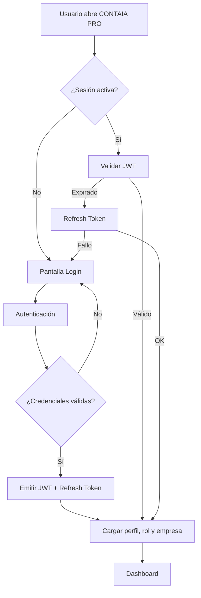
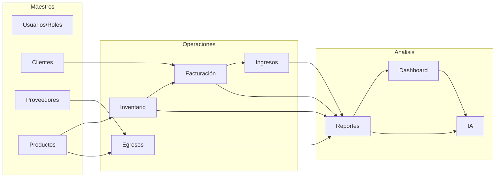
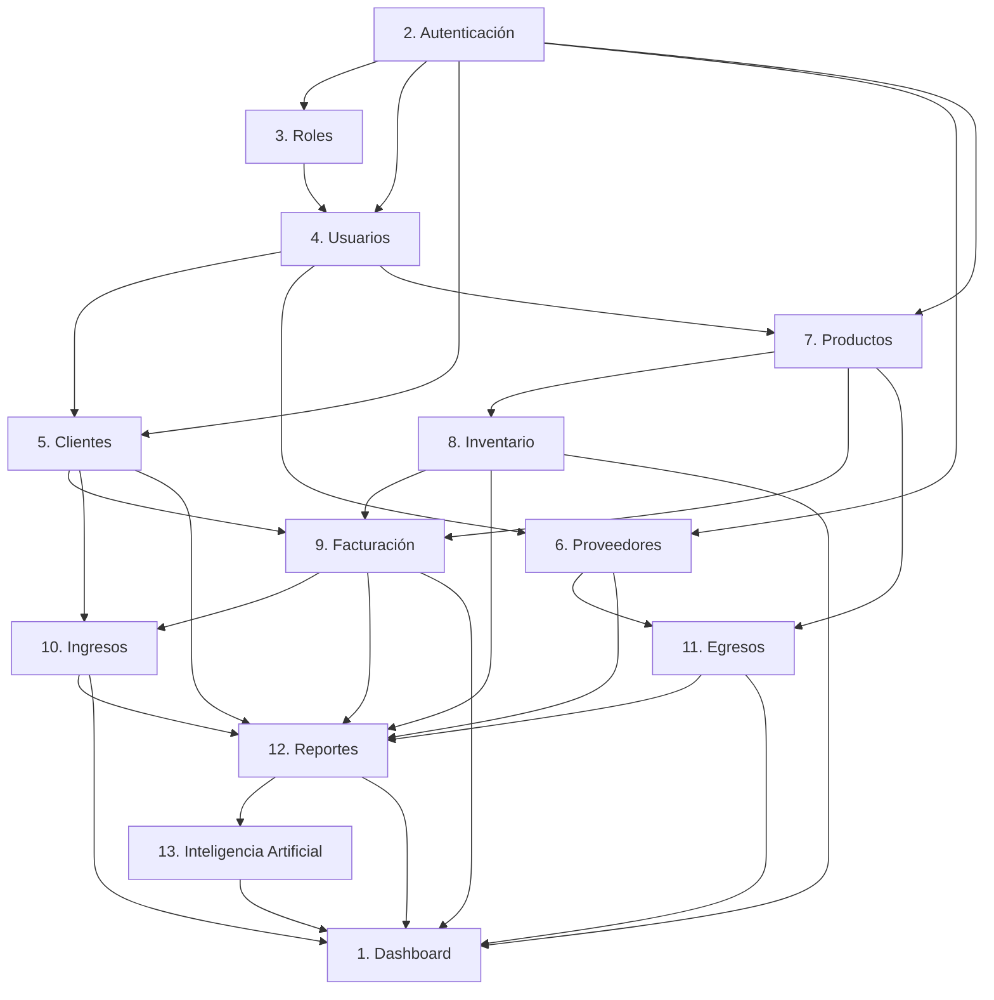
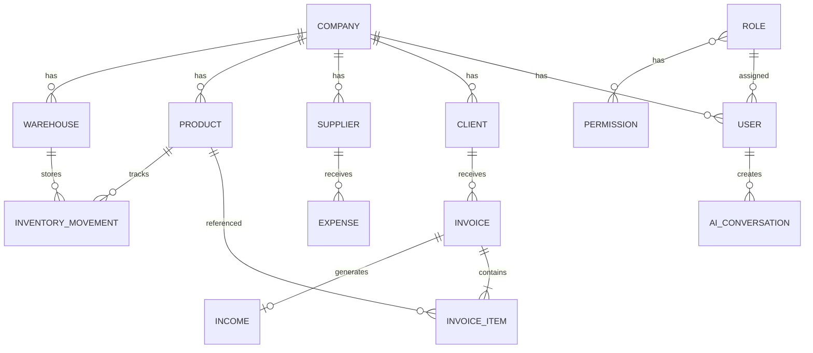

# CONTAIA PRO — Diseño Completo del Sistema

**Sistema Web de Gestión Empresarial y Contable con Inteligencia Artificial**

| Versión | 2.0 — Diseño Funcional Completo |
|---------|----------------------------------|
| Estado | Documento de arquitectura (sin código) |
| Equipo | Arquitectura · Análisis · UX/UI · Backend · Frontend · Seguridad · QA · IA |

---

## Tabla de Contenidos

1. [Visión y Alcance](#1-visión-y-alcance)
2. [Arquitectura General](#2-arquitectura-general)
3. [Arquitectura MVC](#3-arquitectura-mvc)
4. [Flujo General del Sistema](#4-flujo-general-del-sistema)
5. [Flujo Entre Módulos](#5-flujo-entre-módulos)
6. [Estructura de Carpetas](#6-estructura-de-carpetas)
7. [Responsabilidad de Cada Carpeta](#7-responsabilidad-de-cada-carpeta)
8. [Navegación Completa](#8-navegación-completa)
9. [Casos de Uso Principales](#9-casos-de-uso-principales)
10. [Modelo de Datos Conceptual](#10-modelo-de-datos-conceptual)
11. [Seguridad y Permisos](#11-seguridad-y-permisos)
12. [Integración de IA](#12-integración-de-ia)
13. [Plan de Implementación por Módulos](#13-plan-de-implementación-por-módulos)

---

## 1. Visión y Alcance

### 1.1 Propósito

CONTAIA PRO es una plataforma web integral que permite a empresas gestionar operaciones comerciales, inventario, facturación y flujo de caja, con reportes financieros y asistencia por inteligencia artificial.

### 1.2 Usuarios Objetivo

| Perfil | Necesidad principal |
|--------|---------------------|
| Administrador | Configuración global, usuarios, roles, reportes ejecutivos |
| Contador / Financiero | Ingresos, egresos, reportes, conciliación |
| Vendedor | Clientes, facturación, productos |
| Almacenista | Inventario, productos, proveedores |
| Gerente | Dashboard, reportes, asistente IA |

### 1.3 Módulos del Sistema

| # | Módulo | Dominio |
|---|--------|---------|
| 1 | Dashboard | Visualización y KPIs |
| 2 | Autenticación | Acceso seguro al sistema |
| 3 | Roles | Control de permisos (RBAC) |
| 4 | Usuarios | Gestión de cuentas internas |
| 5 | Clientes | Cartera de clientes |
| 6 | Proveedores | Cartera de proveedores |
| 7 | Productos | Catálogo de bienes/servicios |
| 8 | Inventario | Stock, movimientos, bodegas |
| 9 | Facturación | Documentos de venta |
| 10 | Ingresos | Registro de entradas de dinero |
| 11 | Egresos | Registro de salidas de dinero |
| 12 | Reportes | Análisis e informes |
| 13 | Inteligencia Artificial | Asistente, predicciones, insights |

### 1.4 Principios de Diseño

- **MVC** en backend y separación clara de capas en frontend.
- **SOLID** y Clean Code en toda la base de código.
- **Multi-empresa** (tenant) preparado desde el diseño.
- **API REST versionada** (`/api/v1/`).
- **Producción primero**: logging, auditoría, manejo de errores, pruebas.
- **Escalabilidad horizontal**: stateless API, BD relacional, cache opcional.

---

## 2. Arquitectura General

### 2.1 Vista de Alto Nivel

```
┌─────────────────────────────────────────────────────────────────────────┐
│                         CAPA DE PRESENTACIÓN                            │
│  React SPA (TypeScript) — Vite — TailwindCSS — React Router             │
│  Pages · Components · Hooks · Services · Stores                         │
└───────────────────────────────┬─────────────────────────────────────────┘
                                │ HTTPS / JSON
                                ▼
┌─────────────────────────────────────────────────────────────────────────┐
│                         CAPA DE API (MVC)                               │
│  FastAPI — Controllers — Middleware — Validación Pydantic               │
└───────────────────────────────┬─────────────────────────────────────────┘
                                │
                                ▼
┌─────────────────────────────────────────────────────────────────────────┐
│                      CAPA DE LÓGICA DE NEGOCIO                          │
│  Services — Reglas de negocio — Orquestación entre módulos              │
└───────────────────────────────┬─────────────────────────────────────────┘
                                │
              ┌─────────────────┼─────────────────┐
              ▼                 ▼                 ▼
┌──────────────────┐ ┌──────────────────┐ ┌──────────────────┐
│  Repositories    │ │  AI Service      │ │  Eventos / Jobs  │
│  (Persistencia)  │ │  (OpenAI / local)│ │  (futuro)        │
└────────┬─────────┘ └────────┬─────────┘ └────────┬─────────┘
         │                    │                    │
         ▼                    ▼                    ▼
┌──────────────────┐ ┌──────────────────┐ ┌──────────────────┐
│  MySQL 8.1   │ │  API Externa IA  │ │  Redis (cache)   │
│  Datos core      │ │                  │ │  (opcional)      │
└──────────────────┘ └──────────────────┘ └──────────────────┘
```

### 2.2 Stack Tecnológico

| Capa | Tecnología | Justificación |
|------|------------|---------------|
| Frontend | React 18, TypeScript, Vite | Ecosistema maduro, tipado, rendimiento |
| Estilos | TailwindCSS | Consistencia visual, velocidad de desarrollo |
| Estado servidor | TanStack Query | Cache, revalidación, sincronización API |
| Estado cliente | Zustand | Auth, tenant, UI global ligero |
| Backend | Python 3.11+, FastAPI | Async, tipado, documentación automática |
| ORM | SQLAlchemy 2.0 | Estándar Python, migraciones con Alembic |
| BD | MySQL 8.1 | Integridad referencial, reportes complejos |
| Auth | JWT + Refresh Token | Stateless, escalable |
| IA | OpenAI API (abstraído) | Intercambiable por modelo local |
| Contenedores | Docker Compose | Paridad dev/prod |

### 2.3 Patrones Arquitectónicos

| Patrón | Aplicación |
|--------|------------|
| **MVC** | Separación Controller / Service / Model-Schema |
| **Repository** | Abstracción de acceso a datos |
| **DTO (Schema)** | Contratos de entrada/salida API |
| **Dependency Injection** | FastAPI `Depends()` |
| **RBAC** | Roles → Permisos → Recursos |
| **Envelope API** | `{ success, message, data }` uniforme |
| **Soft Delete** | `is_active` en entidades maestras |
| **Auditoría** | `created_at`, `updated_at`, `created_by` |

### 2.4 Contexto Multi-Empresa (Tenant)

Todas las entidades de negocio llevan `company_id`. El tenant se resuelve desde el JWT del usuario autenticado. Ningún servicio accede a datos de otra empresa.

```
Usuario autenticado → JWT (user_id, company_id, roles)
                              ↓
                    Middleware de tenant
                              ↓
              Todos los queries filtran por company_id
```

---

## 3. Arquitectura MVC

### 3.1 MVC en Backend (FastAPI)

En aplicaciones web REST, el patrón MVC se adapta así:

| Capa MVC | Implementación CONTAIA PRO | Responsabilidad |
|----------|---------------------------|-----------------|
| **Model** | `models/` (SQLAlchemy) + `repositories/` | Entidades y persistencia |
| **View** | `schemas/` (Pydantic) | Serialización JSON, validación entrada/salida |
| **Controller** | `controllers/` | Rutas HTTP, códigos de estado, delegación |

La **lógica de negocio** vive en `services/` (capa adicional fuera del MVC clásico, estándar en APIs empresariales).

```
                    ┌─────────────┐
   HTTP Request ──► │ Controller  │  Recibe request, valida con Schema
                    └──────┬──────┘
                           │ delega
                           ▼
                    ┌─────────────┐
                    │  Service    │  Reglas de negocio, transacciones
                    └──────┬──────┘
                           │ usa
                           ▼
                    ┌─────────────┐
                    │ Repository  │  Queries ORM
                    └──────┬──────┘
                           │ opera sobre
                           ▼
                    ┌─────────────┐
                    │   Model     │  Tablas / entidades
                    └─────────────┘
                           │
                           ▼ respuesta
                    ┌─────────────┐
                    │   Schema    │  JSON al cliente ("Vista")
                    └─────────────┘
```

### 3.2 Ejemplo por Módulo — Facturación

| Capa | Archivo ejemplo | Acción |
|------|-----------------|--------|
| Controller | `invoice_controller.py` | `POST /api/v1/invoices` |
| Schema | `invoice_schema.py` | `InvoiceCreate`, `InvoiceResponse` |
| Service | `invoice_service.py` | Validar stock, calcular totales, numerar factura |
| Repository | `invoice_repository.py` | `create()`, `get_by_id()`, `list_paginated()` |
| Model | `invoice.py` | Tabla `invoices` + relación `invoice_items` |

### 3.3 MVC en Frontend (adaptado)

React no es MVC clásico, pero se mapea así:

| Concepto MVC | Frontend CONTAIA PRO |
|--------------|---------------------|
| **Model** | `types/` + `services/` + TanStack Query (datos del servidor) |
| **View** | `pages/` + `components/` (UI) |
| **Controller** | `hooks/` + handlers en pages (lógica de presentación, eventos) |

```
Usuario interactúa → Component/Page (View)
        ↓
    Hook / Handler (Controller lógico)
        ↓
    Service API (Model remoto)
        ↓
    Backend REST
```

### 3.4 Reglas de Capas (SOLID)

| Regla | Descripción |
|-------|-------------|
| Controllers no tienen lógica de negocio | Solo orquestan HTTP |
| Services no conocen HTTP | Reciben datos tipados, retornan entidades/schemas |
| Repositories no tienen reglas de negocio | Solo CRUD y queries |
| Schemas no acceden a BD | Solo validación y serialización |
| Un Service por dominio | `ClientService`, `InvoiceService`, etc. |

---

## 4. Flujo General del Sistema

### 4.1 Flujo de Arranque



### 4.2 Flujo de Operación Diaria



### 4.3 Flujo de una Transacción — Venta Completa

```
1. Usuario autenticado (Vendedor) accede a Facturación
2. Selecciona Cliente (módulo Clientes)
3. Agrega Productos (módulo Productos)
4. Service valida stock disponible (módulo Inventario)
5. Calcula subtotal, impuestos, descuentos, total
6. Genera factura con numeración secuencial por empresa
7. Descuenta stock (movimiento de salida en Inventario)
8. Registra Ingreso pendiente o cobrado (módulo Ingresos)
9. Actualiza KPIs en Dashboard
10. Datos disponibles en Reportes e IA
```

### 4.4 Flujo de una Transacción — Compra / Egreso

```
1. Usuario (Almacenista/Contador) registra compra
2. Selecciona Proveedor (módulo Proveedores)
3. Registra productos recibidos → entrada de Inventario
4. Registra Egreso asociado al pago
5. Actualiza stock y costo promedio
6. Refleja en Reportes de gastos y flujo de caja
```

### 4.5 Flujo de Errores Global

```
Request → Middleware Auth → Middleware Tenant → Controller
    → Service (regla violada) → ContaiaException
    → Error Handler → JSON { success: false, code, message }
    → Frontend muestra notificación al usuario
```

---

## 5. Flujo Entre Módulos

### 5.1 Matriz de Dependencias

| Módulo | Depende de | Alimenta a |
|--------|------------|------------|
| **Dashboard** | Todos (lectura) | — |
| **Autenticación** | — | Todos |
| **Roles** | Autenticación | Usuarios, todos (permisos) |
| **Usuarios** | Auth, Roles | Todos (auditoría) |
| **Clientes** | Auth, Usuarios | Facturación, Ingresos, Reportes, IA |
| **Proveedores** | Auth, Usuarios | Egresos, Inventario, Reportes, IA |
| **Productos** | Auth, Usuarios | Inventario, Facturación, Reportes, IA |
| **Inventario** | Productos | Facturación, Reportes, Dashboard, IA |
| **Facturación** | Clientes, Productos, Inventario | Ingresos, Reportes, Dashboard, IA |
| **Ingresos** | Facturación (opcional), Clientes | Reportes, Dashboard, IA |
| **Egresos** | Proveedores, Productos (opcional) | Reportes, Dashboard, IA |
| **Reportes** | Todos los transaccionales | Dashboard, IA |
| **IA** | Reportes + datos transaccionales | Dashboard (insights) |

### 5.2 Diagrama de Dependencias



### 5.3 Orden de Implementación Recomendado

```
Fase 0 — Fundación (ya iniciada)
    └── Config, health, layout base

Fase 1 — Seguridad
    └── 2. Autenticación → 3. Roles → 4. Usuarios

Fase 2 — Maestros
    └── 5. Clientes → 6. Proveedores → 7. Productos

Fase 3 — Operaciones
    └── 8. Inventario → 9. Facturación

Fase 4 — Finanzas
    └── 10. Ingresos → 11. Egresos

Fase 5 — Inteligencia
    └── 12. Reportes → 1. Dashboard (completo) → 13. IA
```

> El Dashboard se implementa en versión básica desde Fase 1 y se enriquece en Fase 5.

### 5.4 Contratos Entre Módulos (API interna)

Los módulos **no se llaman directamente entre sí en el frontend**. Toda comunicación cross-módulo ocurre en el **backend via Services**:

| Escenario | Servicio que orquesta | Servicios que consume |
|-----------|----------------------|----------------------|
| Crear factura | `InvoiceService` | `ClientService`, `ProductService`, `InventoryService`, `IncomeService` |
| Entrada de stock | `InventoryService` | `ProductService`, `SupplierService` |
| Reporte de ventas | `ReportService` | `InvoiceRepository`, `IncomeRepository` |
| Insight IA | `AIService` | `ReportService`, agregados de todos los dominios |

---

## 6. Estructura de Carpetas

### 6.1 Raíz del Proyecto

```
contaia-pro/
├── backend/                    # API REST Python/FastAPI
├── frontend/                   # SPA React/TypeScript
├── docs/                       # Documentación técnica y funcional
├── docker-compose.yml          # Orquestación de servicios
├── .gitignore
└── README.md
```

### 6.2 Backend — Estructura Completa

```
backend/
├── app/
│   ├── main.py                         # Factory de la aplicación
│   ├── config/
│   │   └── settings.py                 # Variables de entorno tipadas
│   │
│   ├── core/                           # Infraestructura transversal
│   │   ├── database.py                 # Engine, sesión, Base ORM
│   │   ├── security.py                 # JWT, hash passwords
│   │   ├── permissions.py              # Decoradores y checks RBAC
│   │   ├── exceptions.py               # Excepciones de dominio
│   │   ├── logging.py                  # Logging estructurado
│   │   └── pagination.py               # Utilidades de paginación
│   │
│   ├── middleware/
│   │   ├── error_handler.py            # Manejo global de errores
│   │   ├── auth_middleware.py          # Extracción y validación JWT
│   │   └── tenant_middleware.py          # Inyección de company_id
│   │
│   ├── models/                         # Capa MODEL (ORM)
│   │   ├── base.py                     # BaseModel con auditoría
│   │   ├── company.py
│   │   ├── user.py
│   │   ├── role.py
│   │   ├── permission.py
│   │   ├── client.py
│   │   ├── supplier.py
│   │   ├── product.py
│   │   ├── inventory_movement.py
│   │   ├── warehouse.py
│   │   ├── invoice.py
│   │   ├── invoice_item.py
│   │   ├── income.py
│   │   ├── expense.py
│   │   └── ai_conversation.py
│   │
│   ├── schemas/                        # Capa VIEW (DTOs Pydantic)
│   │   ├── common.py                   # Envelopes, paginación, errores
│   │   ├── auth_schema.py
│   │   ├── role_schema.py
│   │   ├── user_schema.py
│   │   ├── client_schema.py
│   │   ├── supplier_schema.py
│   │   ├── product_schema.py
│   │   ├── inventory_schema.py
│   │   ├── invoice_schema.py
│   │   ├── income_schema.py
│   │   ├── expense_schema.py
│   │   ├── report_schema.py
│   │   └── ai_schema.py
│   │
│   ├── repositories/                   # Acceso a datos
│   │   ├── base_repository.py
│   │   ├── user_repository.py
│   │   ├── role_repository.py
│   │   ├── client_repository.py
│   │   ├── supplier_repository.py
│   │   ├── product_repository.py
│   │   ├── inventory_repository.py
│   │   ├── invoice_repository.py
│   │   ├── income_repository.py
│   │   ├── expense_repository.py
│   │   └── report_repository.py
│   │
│   ├── services/                       # Lógica de negocio
│   │   ├── auth_service.py
│   │   ├── role_service.py
│   │   ├── user_service.py
│   │   ├── client_service.py
│   │   ├── supplier_service.py
│   │   ├── product_service.py
│   │   ├── inventory_service.py
│   │   ├── invoice_service.py
│   │   ├── income_service.py
│   │   ├── expense_service.py
│   │   ├── report_service.py
│   │   ├── dashboard_service.py
│   │   └── ai_service.py
│   │
│   ├── controllers/                    # Capa CONTROLLER (rutas HTTP)
│   │   ├── health_controller.py
│   │   ├── auth_controller.py
│   │   ├── role_controller.py
│   │   ├── user_controller.py
│   │   ├── client_controller.py
│   │   ├── supplier_controller.py
│   │   ├── product_controller.py
│   │   ├── inventory_controller.py
│   │   ├── invoice_controller.py
│   │   ├── income_controller.py
│   │   ├── expense_controller.py
│   │   ├── report_controller.py
│   │   ├── dashboard_controller.py
│   │   └── ai_controller.py
│   │
│   └── utils/
│       ├── validators.py               # Validaciones reutilizables
│       ├── formatters.py               # Moneda, fechas
│       └── constants.py                # Enums y constantes globales
│
├── alembic/                            # Migraciones de BD
│   ├── env.py
│   └── versions/
├── tests/
│   ├── unit/
│   ├── integration/
│   └── conftest.py
├── requirements.txt
├── Dockerfile
├── alembic.ini
└── .env.example
```

### 6.3 Frontend — Estructura Completa

```
frontend/
├── public/
│   └── favicon.svg
├── src/
│   ├── main.tsx                        # Bootstrap de la app
│   ├── App.tsx                         # Router raíz
│   │
│   ├── routes/
│   │   ├── index.tsx                   # Definición central de rutas
│   │   ├── ProtectedRoute.tsx          # Guard de autenticación
│   │   └── RoleGuard.tsx               # Guard de permisos
│   │
│   ├── pages/                          # Vistas por módulo
│   │   ├── auth/
│   │   │   ├── LoginPage.tsx
│   │   │   └── ForgotPasswordPage.tsx
│   │   ├── dashboard/
│   │   │   └── DashboardPage.tsx
│   │   ├── roles/
│   │   │   ├── RoleListPage.tsx
│   │   │   └── RoleFormPage.tsx
│   │   ├── users/
│   │   │   ├── UserListPage.tsx
│   │   │   └── UserFormPage.tsx
│   │   ├── clients/
│   │   │   ├── ClientListPage.tsx
│   │   │   └── ClientFormPage.tsx
│   │   ├── suppliers/
│   │   │   ├── SupplierListPage.tsx
│   │   │   └── SupplierFormPage.tsx
│   │   ├── products/
│   │   │   ├── ProductListPage.tsx
│   │   │   └── ProductFormPage.tsx
│   │   ├── inventory/
│   │   │   ├── InventoryPage.tsx
│   │   │   └── MovementFormPage.tsx
│   │   ├── invoicing/
│   │   │   ├── InvoiceListPage.tsx
│   │   │   └── InvoiceFormPage.tsx
│   │   ├── income/
│   │   │   ├── IncomeListPage.tsx
│   │   │   └── IncomeFormPage.tsx
│   │   ├── expenses/
│   │   │   ├── ExpenseListPage.tsx
│   │   │   └── ExpenseFormPage.tsx
│   │   ├── reports/
│   │   │   ├── ReportHubPage.tsx
│   │   │   ├── SalesReportPage.tsx
│   │   │   ├── IncomeExpenseReportPage.tsx
│   │   │   └── InventoryReportPage.tsx
│   │   ├── ai/
│   │   │   └── AIAssistantPage.tsx
│   │   └── NotFoundPage.tsx
│   │
│   ├── components/
│   │   ├── layout/
│   │   │   ├── MainLayout.tsx
│   │   │   ├── AuthLayout.tsx
│   │   │   ├── Sidebar.tsx
│   │   │   ├── Header.tsx
│   │   │   └── Breadcrumb.tsx
│   │   ├── ui/                         # Design system base
│   │   │   ├── Button.tsx
│   │   │   ├── Input.tsx
│   │   │   ├── Select.tsx
│   │   │   ├── Modal.tsx
│   │   │   ├── Table.tsx
│   │   │   ├── Badge.tsx
│   │   │   ├── Card.tsx
│   │   │   ├── Pagination.tsx
│   │   │   ├── Spinner.tsx
│   │   │   └── Toast.tsx
│   │   ├── forms/                      # Formularios reutilizables
│   │   │   ├── ClientForm.tsx
│   │   │   ├── ProductForm.tsx
│   │   │   └── InvoiceLineItems.tsx
│   │   └── charts/                     # Gráficos del dashboard/reportes
│   │       ├── LineChart.tsx
│   │       ├── BarChart.tsx
│   │       └── DonutChart.tsx
│   │
│   ├── services/                       # Clientes API (Model remoto)
│   │   ├── api.ts                      # Axios instance + interceptors
│   │   ├── authService.ts
│   │   ├── roleService.ts
│   │   ├── userService.ts
│   │   ├── clientService.ts
│   │   ├── supplierService.ts
│   │   ├── productService.ts
│   │   ├── inventoryService.ts
│   │   ├── invoiceService.ts
│   │   ├── incomeService.ts
│   │   ├── expenseService.ts
│   │   ├── reportService.ts
│   │   ├── dashboardService.ts
│   │   └── aiService.ts
│   │
│   ├── hooks/                          # Controller lógico del frontend
│   │   ├── useAuth.ts
│   │   ├── usePermissions.ts
│   │   ├── useClients.ts
│   │   ├── useProducts.ts
│   │   ├── useInvoices.ts
│   │   └── useDashboard.ts
│   │
│   ├── stores/                         # Estado global del cliente
│   │   ├── authStore.ts
│   │   └── uiStore.ts
│   │
│   ├── types/                          # Contratos TypeScript
│   │   ├── api.ts
│   │   ├── auth.ts
│   │   ├── user.ts
│   │   ├── client.ts
│   │   ├── product.ts
│   │   ├── invoice.ts
│   │   └── report.ts
│   │
│   ├── utils/
│   │   ├── constants.ts
│   │   ├── formatters.ts
│   │   └── permissions.ts
│   │
│   └── styles/
│       └── globals.css
│
├── index.html
├── package.json
├── vite.config.ts
├── tailwind.config.js
├── tsconfig.json
├── Dockerfile
└── .env.example
```

### 6.4 Documentación

```
docs/
├── 00-DISENO-COMPLETO-CONTAIA-PRO.md     # Este documento
├── 01-ARQUITECTURA.md
├── 02-MODULO-01-FUNDACION.md
├── 03-DISENO-UX-UI.md
├── 04-MODELO-DATOS.md                    # (futuro)
├── 05-API-REFERENCE.md                   # (futuro)
└── modulos/
    ├── 02-autenticacion.md
    ├── 03-roles.md
    └── ...                               # Un doc por módulo
```

---

## 7. Responsabilidad de Cada Carpeta

### 7.1 Backend

| Carpeta | Responsabilidad | Qué NO debe hacer |
|---------|-----------------|-------------------|
| `config/` | Cargar y validar variables de entorno | Lógica de negocio |
| `core/` | Infraestructura compartida (BD, JWT, logs) | Reglas de dominio específicas |
| `middleware/` | Cross-cutting HTTP (auth, tenant, errores) | Queries a BD |
| `models/` | Definir tablas y relaciones ORM | Validar requests HTTP |
| `schemas/` | Validar entrada/salida, serializar JSON | Acceder a BD |
| `repositories/` | CRUD y queries optimizadas | Reglas de negocio |
| `services/` | Lógica de negocio y orquestación | Conocer HTTP status codes |
| `controllers/` | Rutas, status codes, delegar a services | Lógica de negocio |
| `utils/` | Helpers puros sin estado | Depender de FastAPI Request |
| `tests/` | Pruebas unitarias e integración | — |
| `alembic/` | Migraciones versionadas de esquema | — |

### 7.2 Frontend

| Carpeta | Responsabilidad | Qué NO debe hacer |
|---------|-----------------|-------------------|
| `pages/` | Componer vistas completas por ruta | Llamadas HTTP directas (usar hooks/services) |
| `components/layout/` | Shell visual (sidebar, header) | Lógica de negocio |
| `components/ui/` | Componentes atómicos reutilizables | Conocer dominio específico |
| `components/forms/` | Formularios de dominio reutilizables | Fetch directo sin service |
| `components/charts/` | Visualización de datos | Calcular agregados (viene del backend) |
| `services/` | Comunicación HTTP con la API | Manipular DOM |
| `hooks/` | Estado local de UI + integración con Query | Renderizar JSX complejo |
| `stores/` | Estado global (auth, UI) | Duplicar datos del servidor |
| `types/` | Contratos TypeScript | Lógica ejecutable |
| `routes/` | Definición y protección de rutas | Componentes visuales |
| `utils/` | Formateo, constantes, helpers | Estado de aplicación |

---

## 8. Navegación Completa

### 8.1 Mapa de Rutas

| Ruta | Módulo | Permiso requerido | Descripción |
|------|--------|-------------------|-------------|
| `/login` | Auth | Público | Inicio de sesión |
| `/forgot-password` | Auth | Público | Recuperación de contraseña |
| `/` | Dashboard | `dashboard:read` | Panel principal |
| `/roles` | Roles | `roles:read` | Lista de roles |
| `/roles/new` | Roles | `roles:create` | Crear rol |
| `/roles/:id/edit` | Roles | `roles:update` | Editar rol |
| `/users` | Usuarios | `users:read` | Lista de usuarios |
| `/users/new` | Usuarios | `users:create` | Crear usuario |
| `/users/:id/edit` | Usuarios | `users:update` | Editar usuario |
| `/clients` | Clientes | `clients:read` | Lista de clientes |
| `/clients/new` | Clientes | `clients:create` | Crear cliente |
| `/clients/:id` | Clientes | `clients:read` | Detalle de cliente |
| `/clients/:id/edit` | Clientes | `clients:update` | Editar cliente |
| `/suppliers` | Proveedores | `suppliers:read` | Lista de proveedores |
| `/suppliers/new` | Proveedores | `suppliers:create` | Crear proveedor |
| `/suppliers/:id/edit` | Proveedores | `suppliers:update` | Editar proveedor |
| `/products` | Productos | `products:read` | Catálogo de productos |
| `/products/new` | Productos | `products:create` | Crear producto |
| `/products/:id/edit` | Productos | `products:update` | Editar producto |
| `/inventory` | Inventario | `inventory:read` | Stock actual |
| `/inventory/movements` | Inventario | `inventory:read` | Historial de movimientos |
| `/inventory/movements/new` | Inventario | `inventory:create` | Registrar movimiento |
| `/invoicing` | Facturación | `invoices:read` | Lista de facturas |
| `/invoicing/new` | Facturación | `invoices:create` | Nueva factura |
| `/invoicing/:id` | Facturación | `invoices:read` | Detalle de factura |
| `/income` | Ingresos | `income:read` | Lista de ingresos |
| `/income/new` | Ingresos | `income:create` | Registrar ingreso |
| `/expenses` | Egresos | `expenses:read` | Lista de egresos |
| `/expenses/new` | Egresos | `expenses:create` | Registrar egreso |
| `/reports` | Reportes | `reports:read` | Hub de reportes |
| `/reports/sales` | Reportes | `reports:read` | Reporte de ventas |
| `/reports/income-expense` | Reportes | `reports:read` | Ingresos vs egresos |
| `/reports/inventory` | Reportes | `reports:read` | Reporte de inventario |
| `/ai` | IA | `ai:use` | Asistente inteligente |
| `*` | — | — | Página 404 |

### 8.2 Menú Lateral (Sidebar)

```
CONTAIA PRO
─────────────────────────
📊  Dashboard                    →  /
─────────────────────────
ADMINISTRACIÓN
👥  Usuarios                     →  /users          [admin]
🛡️  Roles                        →  /roles          [admin]
─────────────────────────
COMERCIAL
🧑‍💼  Clientes                     →  /clients
🏭  Proveedores                  →  /suppliers
📦  Productos                    →  /products
─────────────────────────
OPERACIONES
📋  Inventario                   →  /inventory
🧾  Facturación                  →  /invoicing
─────────────────────────
FINANZAS
💰  Ingresos                     →  /income
💸  Egresos                      →  /expenses
📈  Reportes                     →  /reports
─────────────────────────
INTELIGENCIA
🤖  Asistente IA                 →  /ai
─────────────────────────
[Usuario]  [Cerrar sesión]
```

### 8.3 Navegación por Rol

| Ítem de menú | Admin | Contador | Vendedor | Almacenista | Gerente |
|--------------|:-----:|:--------:|:--------:|:-------------:|:-------:|
| Dashboard | ✅ | ✅ | ✅ | ✅ | ✅ |
| Usuarios | ✅ | ❌ | ❌ | ❌ | ❌ |
| Roles | ✅ | ❌ | ❌ | ❌ | ❌ |
| Clientes | ✅ | ✅ | ✅ | ❌ | ✅ |
| Proveedores | ✅ | ✅ | ❌ | ✅ | ✅ |
| Productos | ✅ | ✅ | ✅ | ✅ | ✅ |
| Inventario | ✅ | ✅ | ❌ | ✅ | ✅ |
| Facturación | ✅ | ✅ | ✅ | ❌ | ✅ |
| Ingresos | ✅ | ✅ | ❌ | ❌ | ✅ |
| Egresos | ✅ | ✅ | ❌ | ❌ | ✅ |
| Reportes | ✅ | ✅ | ❌ | ❌ | ✅ |
| Asistente IA | ✅ | ✅ | ✅ | ✅ | ✅ |

### 8.4 Breadcrumbs por Sección

```
Dashboard
    └── (sin breadcrumb)

Clientes > Lista
Clientes > Nuevo
Clientes > [Nombre] > Editar

Facturación > Lista
Facturación > Nueva factura
Facturación > FAC-0001

Reportes > Ventas
Reportes > Ingresos vs Egresos
```

---

## 9. Casos de Uso Principales

### 9.1 Módulo 1 — Dashboard

| ID | Caso de uso | Actor | Descripción |
|----|-------------|-------|-------------|
| CU-D01 | Ver resumen ejecutivo | Gerente, Admin | KPIs: ventas del mes, ingresos, egresos, stock bajo |
| CU-D02 | Ver gráfico de ventas | Gerente | Tendencia de ventas últimos 12 meses |
| CU-D03 | Ver alertas del sistema | Admin | Productos sin stock, facturas vencidas |
| CU-D04 | Ver insights de IA | Gerente | Recomendaciones generadas por el asistente |

### 9.2 Módulo 2 — Autenticación

| ID | Caso de uso | Actor | Descripción |
|----|-------------|-------|-------------|
| CU-A01 | Iniciar sesión | Todos | Email + contraseña → JWT |
| CU-A02 | Cerrar sesión | Todos | Invalidar refresh token |
| CU-A03 | Renovar token | Todos | Refresh token → nuevo JWT |
| CU-A04 | Recuperar contraseña | Todos | Email con enlace de reset |
| CU-A05 | Cambiar contraseña | Usuario autenticado | Contraseña actual + nueva |

### 9.3 Módulo 3 — Roles

| ID | Caso de uso | Actor | Descripción |
|----|-------------|-------|-------------|
| CU-R01 | Listar roles | Admin | Ver roles del sistema y personalizados |
| CU-R02 | Crear rol | Admin | Nombre + permisos asignados |
| CU-R03 | Editar rol | Admin | Modificar permisos de un rol |
| CU-R04 | Eliminar rol | Admin | Soft delete si no tiene usuarios activos |
| CU-R05 | Ver permisos disponibles | Admin | Catálogo de permisos del sistema |

### 9.4 Módulo 4 — Usuarios

| ID | Caso de uso | Actor | Descripción |
|----|-------------|-------|-------------|
| CU-U01 | Listar usuarios | Admin | Paginado, búsqueda por nombre/email |
| CU-U02 | Crear usuario | Admin | Datos personales + rol + contraseña temporal |
| CU-U03 | Editar usuario | Admin | Actualizar datos y rol |
| CU-U04 | Desactivar usuario | Admin | Soft delete, revoca acceso |
| CU-U05 | Ver perfil propio | Usuario | Datos y preferencias del usuario logueado |

### 9.5 Módulo 5 — Clientes

| ID | Caso de uso | Actor | Descripción |
|----|-------------|-------|-------------|
| CU-C01 | Listar clientes | Vendedor, Admin | Búsqueda, filtros, paginación |
| CU-C02 | Crear cliente | Vendedor | Nombre, documento, contacto, dirección |
| CU-C03 | Editar cliente | Vendedor | Actualizar datos |
| CU-C04 | Ver historial del cliente | Vendedor | Facturas e ingresos asociados |
| CU-C05 | Desactivar cliente | Admin | Soft delete |

### 9.6 Módulo 6 — Proveedores

| ID | Caso de uso | Actor | Descripción |
|----|-------------|-------|-------------|
| CU-P01 | Listar proveedores | Almacenista, Admin | Búsqueda y paginación |
| CU-P02 | Crear proveedor | Almacenista | Datos fiscales y de contacto |
| CU-P03 | Editar proveedor | Almacenista | Actualizar información |
| CU-P04 | Ver historial de compras | Contador | Egresos asociados al proveedor |

### 9.7 Módulo 7 — Productos

| ID | Caso de uso | Actor | Descripción |
|----|-------------|-------|-------------|
| CU-PR01 | Listar productos | Todos (con permiso) | Catálogo con precio y stock |
| CU-PR02 | Crear producto | Admin, Almacenista | SKU, nombre, precio, categoría |
| CU-PR03 | Editar producto | Admin, Almacenista | Actualizar precio, datos |
| CU-PR04 | Definir precio de venta | Admin | Precio unitario, impuesto |
| CU-PR05 | Desactivar producto | Admin | No aparece en nuevas facturas |

### 9.8 Módulo 8 — Inventario

| ID | Caso de uso | Actor | Descripción |
|----|-------------|-------|-------------|
| CU-I01 | Ver stock actual | Almacenista | Por producto y bodega |
| CU-I02 | Registrar entrada | Almacenista | Compra, devolución, ajuste positivo |
| CU-I03 | Registrar salida | Almacenista | Venta (auto), merma, ajuste negativo |
| CU-I04 | Ver historial de movimientos | Almacenista | Filtro por fecha, producto, tipo |
| CU-I05 | Alerta de stock mínimo | Sistema | Notifica cuando stock < mínimo configurado |

### 9.9 Módulo 9 — Facturación

| ID | Caso de uso | Actor | Descripción |
|----|-------------|-------|-------------|
| CU-F01 | Listar facturas | Vendedor, Contador | Filtro por estado, fecha, cliente |
| CU-F02 | Crear factura | Vendedor | Cliente + líneas de producto + totales |
| CU-F03 | Validar stock al facturar | Sistema | Impide facturar sin stock suficiente |
| CU-F04 | Anular factura | Admin, Contador | Reverso de stock e ingreso |
| CU-F05 | Imprimir / exportar PDF | Vendedor | Documento de factura |
| CU-F06 | Numeración automática | Sistema | Secuencia por empresa: FAC-0001 |

### 9.10 Módulo 10 — Ingresos

| ID | Caso de uso | Actor | Descripción |
|----|-------------|-------|-------------|
| CU-IN01 | Listar ingresos | Contador | Por fecha, cliente, método de pago |
| CU-IN02 | Registrar ingreso manual | Contador | Monto, concepto, categoría |
| CU-IN03 | Registrar cobro de factura | Contador | Vincula ingreso a factura |
| CU-IN04 | Ver ingresos del período | Contador | Filtro por rango de fechas |

### 9.11 Módulo 11 — Egresos

| ID | Caso de uso | Actor | Descripción |
|----|-------------|-------|-------------|
| CU-E01 | Listar egresos | Contador | Por fecha, proveedor, categoría |
| CU-E02 | Registrar egreso | Contador | Monto, concepto, proveedor opcional |
| CU-E03 | Categorizar egreso | Contador | Tipo: operativo, nómina, impuestos, etc. |
| CU-E04 | Ver egresos del período | Contador | Filtro por rango de fechas |

### 9.12 Módulo 12 — Reportes

| ID | Caso de uso | Actor | Descripción |
|----|-------------|-------|-------------|
| CU-RE01 | Reporte de ventas | Gerente, Contador | Por período, cliente, producto |
| CU-RE02 | Reporte ingresos vs egresos | Contador | Flujo de caja del período |
| CU-RE03 | Reporte de inventario | Almacenista | Valorización y rotación |
| CU-RE04 | Exportar a PDF/Excel | Contador | Descarga del reporte |
| CU-RE05 | Reporte de cuentas por cobrar | Contador | Facturas pendientes de pago |

### 9.13 Módulo 13 — Inteligencia Artificial

| ID | Caso de uso | Actor | Descripción |
|----|-------------|-------|-------------|
| CU-IA01 | Consultar asistente | Todos | Preguntas en lenguaje natural sobre el negocio |
| CU-IA02 | Análisis de ventas | Gerente | IA interpreta tendencias y anomalías |
| CU-IA03 | Recomendaciones de stock | Almacenista | Sugerencias de reorden basadas en historial |
| CU-IA04 | Resumen ejecutivo automático | Gerente | IA genera resumen mensual |
| CU-IA05 | Predicción de flujo de caja | Contador | Proyección basada en histórico |

---

## 10. Modelo de Datos Conceptual

### 10.1 Entidades Principales



### 10.2 Campos Comunes (BaseModel)

Todas las entidades heredan:

| Campo | Tipo | Descripción |
|-------|------|-------------|
| `id` | UUID | Identificador único |
| `company_id` | UUID | Tenant (excepto Company, Role sistema) |
| `created_at` | DateTime | Fecha de creación |
| `updated_at` | DateTime | Última modificación |
| `is_active` | Boolean | Soft delete |
| `created_by` | String | Usuario que creó |
| `updated_by` | String | Usuario que modificó |

---

## 11. Seguridad y Permisos

### 11.1 Modelo RBAC

```
Usuario → tiene → Rol(es) → tienen → Permisos
Permiso = recurso:acción
Ejemplo: invoices:create, reports:read, users:delete
```

### 11.2 Catálogo de Permisos

| Recurso | Acciones |
|---------|----------|
| `dashboard` | read |
| `users` | read, create, update, delete |
| `roles` | read, create, update, delete |
| `clients` | read, create, update, delete |
| `suppliers` | read, create, update, delete |
| `products` | read, create, update, delete |
| `inventory` | read, create, update |
| `invoices` | read, create, update, delete |
| `income` | read, create, update, delete |
| `expenses` | read, create, update, delete |
| `reports` | read, export |
| `ai` | use |

### 11.3 Roles Predefinidos

| Rol | Permisos |
|-----|----------|
| **Administrador** | Todos |
| **Contador** | dashboard, clients, suppliers, products, inventory:read, invoices, income, expenses, reports, ai |
| **Vendedor** | dashboard, clients, products:read, invoices, ai |
| **Almacenista** | dashboard, suppliers, products, inventory, ai |
| **Gerente** | dashboard, reports, ai + lectura de todos los módulos |

### 11.4 Flujo de Autorización

```
Request + JWT
    → auth_middleware: valida token, extrae user_id
    → tenant_middleware: extrae company_id
    → controller: verifica permiso requerido
    → service: ejecuta con contexto de tenant
```

---

## 12. Integración de Inteligencia Artificial

### 12.1 Arquitectura IA

```
Frontend (AIAssistantPage)
    → ai_controller
    → ai_service
        ├── Construye contexto (report_service, agregados)
        ├── Envía prompt a proveedor (OpenAI / local)
        └── Persiste conversación (ai_conversation model)
    → Respuesta estructurada al frontend
```

### 12.2 Tipos de Interacción

| Tipo | Entrada | Salida |
|------|---------|--------|
| Chat libre | Pregunta del usuario | Respuesta contextualizada |
| Análisis automático | Período seleccionado | Informe en lenguaje natural |
| Alertas inteligentes | Datos de inventario/ventas | Lista de recomendaciones |
| Predicción | Histórico financiero | Proyección con intervalo de confianza |

### 12.3 Principios de IA

- **Nunca** enviar datos de otras empresas al contexto del prompt.
- **Siempre** citar la fuente de los datos en la respuesta.
- El proveedor de IA es **intercambiable** vía interfaz en `ai_service`.
- Las conversaciones se almacenan para historial del usuario.

---

## 13. Plan de Implementación por Módulos

| Fase | Módulos | Entregable |
|------|---------|------------|
| **0** | Fundación | Estructura, health, layout, Docker |
| **1** | Auth → Roles → Usuarios | Login, RBAC, gestión de cuentas |
| **2** | Clientes → Proveedores → Productos | Maestros comerciales |
| **3** | Inventario → Facturación | Operaciones con stock |
| **4** | Ingresos → Egresos | Flujo de caja |
| **5** | Reportes → Dashboard → IA | Análisis e inteligencia |

### Criterio de "Módulo Completo"

Un módulo se considera terminado cuando incluye:

1. Model + Migration (Alembic)
2. Schema (Create, Update, Response)
3. Repository + Service + Controller
4. Tests unitarios del service + integración del endpoint
5. Pages + Components + Service en frontend
6. Navegación y permisos integrados
7. Documentación en `docs/modulos/`

---

## Resumen Ejecutivo

CONTAIA PRO se construye sobre una **arquitectura MVC en capas** con backend FastAPI y frontend React, organizada en **13 módulos funcionales** con dependencias claras. La seguridad se basa en **JWT + RBAC multi-tenant**. Los módulos transaccionales (Facturación, Inventario, Ingresos, Egresos) orquestan los maestros (Clientes, Proveedores, Productos) a través de la capa de Services. Reportes, Dashboard e IA consumen datos agregados sin duplicar lógica de negocio.

**Siguiente paso:** Implementar **Módulo 2 — Autenticación** (sin avanzar hasta completarlo).

---

*Documento aprobado por el equipo CONTAIA PRO — Diseño v2.0*
