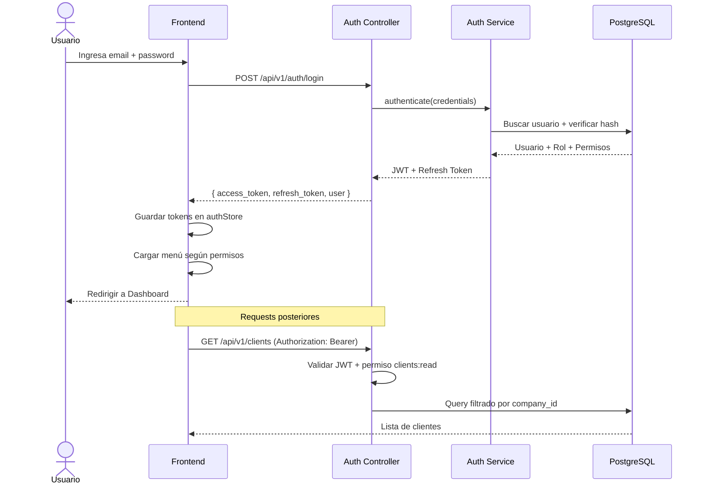
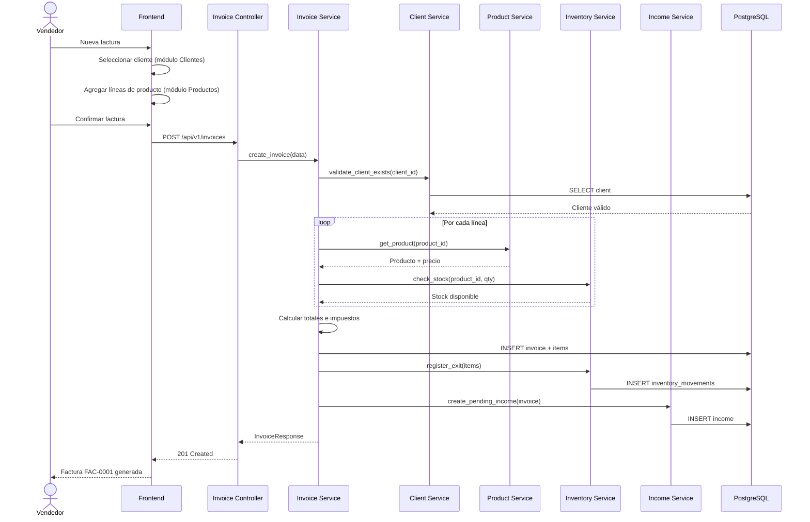
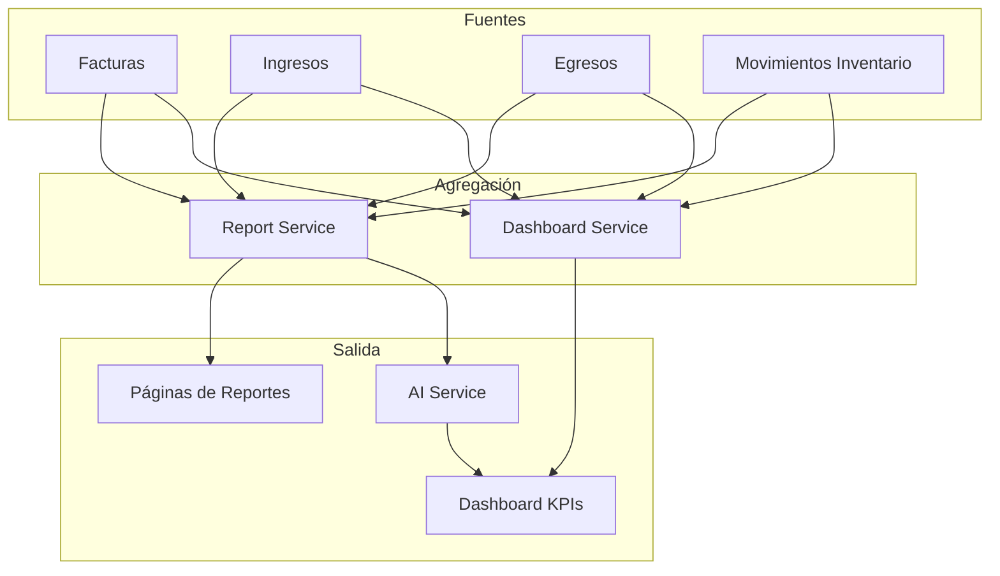
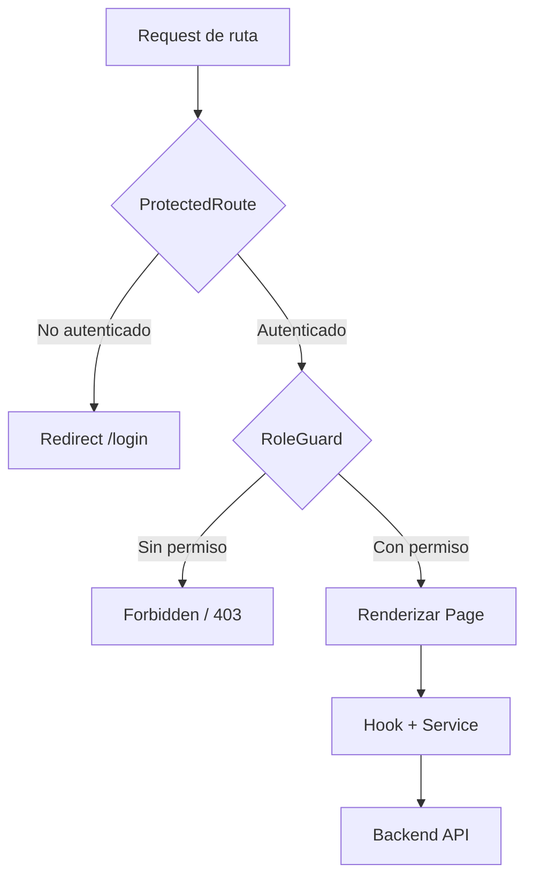
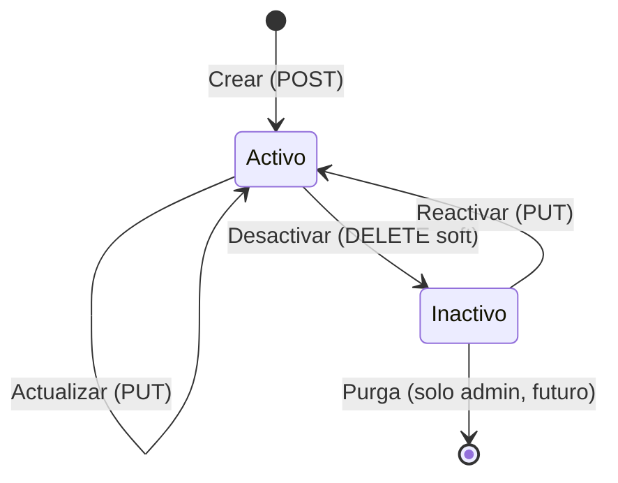
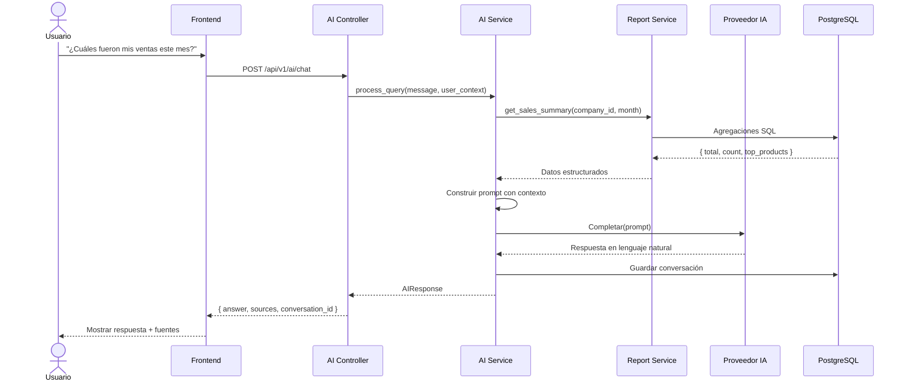

# CONTAIA PRO — Diagramas de Flujo Detallados

Complemento visual del documento de diseño completo.

---

## 1. Flujo de Autenticación y Acceso a Módulos

---

## 2. Flujo de Creación de Factura (Cross-Módulo)

---

## 3. Flujo de Datos hacia Reportes y Dashboard

---

## 4. Flujo de Permisos en Frontend

---

## 5. Ciclo de Vida de una Entidad Maestra

Aplica a: Clientes, Proveedores, Productos, Usuarios.

---

## 6. Flujo del Asistente IA

---

*Diagramas — CONTAIA PRO v2.0*
